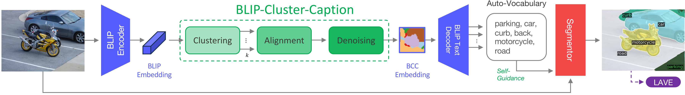

# Project report

In this project, we wante to implement [Auto-Vocabulary Semantic Segmentation [arXiv link]](https://arxiv.org/abs/2312.04539v2).

This work creates a framework for auto-vocabulary segmentation that generates relevant class names from a given and uses them to segment this image with a pre-trained Open Vocabulary Segmentation model.

Our project focuses on implementing a simplified version of this paper, given the fact that to the best of our knowledge, the paper public implementation had not been available publicly, before we started to work on the implementation. At the time of writing this report though, when we already implemented it, we found out that the implementation backing the claims of the authors is actually available in [https://github.com/maxkulicki/maskblip/tree/main](https://github.com/maxkulicki/maskblip/tree/main), but it's not documented and we did not consult it.

<!-- Find the slot for your team​ (will be updated prior to the deadline)
Provide 5 main slides (Template provided for inspiration):​
Team info and project TLDR​
What was the task/problem you were solving. Why it matters to you​
What was the approach and models you have tried. What was the data​
What were the results, are you happy with them​
What were the conclusions, what have you learned, what was good or bad?​
Remember about the TIME: 7 MINUTES per team + 3 minutes for questions!​
Provide UP TO 5 backup slides:​
Mandatory: ​
Link to report (link to a viewable colab, to git, to nbviewer, to teams…). Upload the report with the notebook to GDrive.
Optional:​
More figures, tables, intuitions​ -->

You can see our code in a self-contained Jupyter Notebook: [playground.ipynb](./playground.ipynb).

## Method description

The setup is described fairly well by the illustration from the original paper:

.

We encode patches of the original image in a two similar runs with two different resolutions (we just scale the image and interpolate the positional embeddings, so the image can be fed into the model).

The encoding comes from the ViT part of the BLIP model (a multi-modal model for embedding images and captions able to generate a caption for a given image). For every run we clusterize the embedded image patches by running $k$-Means for $k \in {2, 8}$.

This gives 4 sets of patch clusterisation. From now on, we denote the set with the highest number of clusters (on of the $k=8$ with no collapsed clusters). We align those other cluster sets with this one clusters with Hungarian matching algorithm.

Now we got some kind of ensemble, so for every pixel of the image every of the cluster sets votes for a cluster in the reference cluster set. This already gives some kind of a noisy segmentation mask for every patch set associated with each cluster in the reference cluster set.

Now we try to smoothen these masks. This is done by majority voting and CRF filtering. In this process we obtain denoised low-resolution semantic segmentation masks, each associated with a patch cluster from the reference cluster set. This is the semantic segmentation map you see in the pipeline diagram.

The masks are not labeled yet though. This is why we feed the original BLIP ViT embeddings for these patches and generate a caption for each with BLIP BERT Causal Language Modelling head that you would normally use to generate a caption for a BLIP ViT embedding encoding a full image (based on an output for the BLIP ViT `[ENCODE]` token).

We extract nouns from these "captions", which is called "Self-Guidance" in the diagram. The word set is labeled as "Auto-Vocabulary" in the diagram.

The nouns can be later fed to a pretrained Open-Vocabulary Segmentation that can segment an arbitrary image to masks described by a label set provided by the user, namely X-Decoder.

Finally, the authors evaluate the results using a LAVE evaluation framework (or LOVE in the `v1` version of the paper on ArXiv) they created. This is because you need to align the predicted labels with those present in a supervised segmentation dataset. This is the part we haven't implemented -- we only provide qualitative results.

## Results

Given no other team members, the only results we provide those that are not quantative and present in the mentioned Jupyter Notebook: [playground.ipynb](./playground.ipynb).

We provide extensive visualisations for every step of the pipeline though. It seems that in most of the cases we are able to provide reasonable classess to label, but this might be improved. In particular, filtering the cluster captions to get nouns only is an oversimplification, e.g. we get "retriever" instead of "golden retriever" that way, we should try to filter out phrases instead, which should be fairly easy to achieve with some NLP framework/.

## Implementation differences

1. We use outputs of both [small](https://huggingface.co/Salesforce/blip-image-captioning-base) and [large](https://huggingface.co/Salesforce/blip-image-captioning-large) BLIP to get more cluster sets (the authors use the large model only).
2. We overlooked the fact that the authors run $k$-means for $k \in {2, \cdots, 8}$. We do this for $k \in {2, 8}$ only.
3. The original work runs CRF until convergence or at most 8 times, our implementation does this only once.

It also happens for some images that we get clusters with NaN cluster confidence. This is to be investigated.

Given that, we may possibly get improvements in masks and captions from the BLIP-Cluster-Caption procedure. That would also contribute to higher quality of downstream X-Decoder segmentation outputs.

<!-- ### Clustering

For a given input image, we will run BLIP a few times to obtain patch embeddings:

1. We will run inference with the image scaled to $384 \times 384$ and the image scaled to $512 \times 512$ (with interpolated positional embeddings).
2. For the small BLIP model and its large version (not present in the paper, where they only use the large model).

This gives $2 \cdot 2 = 4$ BLIP runs.

For every run, we obtain 

By default, BLIP expects an RGB image $X^D \in R^{384 \times 384 \times 3}$.
Since common datasets often have images with higher resolution, we additionally process the image at a larger resolution $X^H \in R^{512 \times 512 \times 3}$. The multi-resolution set of images $X = \{X^D, X^H\}$ is fed to the BLIP encoder to obtain the set of BLIP patch embeddings $\hat{B} = \{\hat{B}_D, \hat{B}_H\}$ at the two resolutions:

$P_{X^D} = X_D, 1 \leq i, j \leq 24, X_{ij} \in R^{16 \times 16 \times 3}$

$P_{X^H} = X_{ij}, X_{ij} \in R^{16 \times 16 \times 3}, 1 \leq i, j \leq 32$

$\hat{B}_n = T fMLP(P_n) \oplus z_n, \forall n \in \{1, 2, ..., N\}$

where $P_{X^D} \in R^{576 \times 16 \times 16 \times 3}$ and $P_{X^H} \in R^{1024 \times 16 \times 16 \times 3}$ denote the set of patches in resolutions D and H respectively, $fMLP(\cdot)$ represents a shared fully connected Multi-Layer Perceptron (MLP), and $T$ is a Transformer encoder consisting of $L$ alternating layers of Multi-Head Self-Attention (MHA) and an MLP, sequentially propagated with the function composition operator $\circ$:

$T_l(X) = X + MHA(LayerNorm(X, X, X))$

$\hat{T}_l(X) = T_l(X) + fMLP(LayerNorm(T_l(X)))$

$T(X) = (\hat{T}_{L-1} \circ \hat{T}_{L-2} \circ ... \circ \hat{T}_0)(X)$

In Eq. (3), we additionally concatenate a sinusoidal positional encoding $z_i \in R^{256}$ to each patch $i$ to encode spatial information, where $N$ is the total number of patches for each resolution $R$. Next, we cluster the patches in $\hat{B}$ for each resolution $R$ using k-means clustering:

$C_k^R = \arg \min_C \sum_{i=1}^{N} \min_{\mu_j \in C} \|B_i - \mu_j\|_2$

where $C_k$ is the set of $k$ clusters and $\mu_i$ are the cluster centroids. Running the clustering procedure with a range of 2 to 8 for $k$ on two different image resolutions results in 14 different cluster assignments.

Cross-clustering Consistency. Each run of k-means clustering labels its clusters independently from others, yielding a correspondence mismatch between clusters across runs. To resolve this, we relabel the cluster indices to a common reference frame with the following steps:

1. Select $C$ with the most clusters after k-means as a reference set $S$. As some clusters end up empty during the k-means iterations, this is not always the set with the highest initial $k$. The reference set determines the indices used for all other sets of clusters $C$, each with its number of clusters denoted by $|C_i|$:

$S = \arg \max_{|C_i|} |C_i|$

2. Sets of clusters are aligned to the reference set using Hungarian matching. We calculate pairwise Intersection over Union (IoU) between the clusters from $S$ and $C$. Then, each cluster from $C$ is assigned a new index, matching the cluster with the highest IoU from $S$:

For each cluster $c_j \in C$,
$j \in \{1, ..., |C|\}$:
Assign index $i$ to $c_j$ where $i = \arg \max_{IoU(c_j, s_i)} IoU(c_j, s_i)$

3. With the labeled sets of clusters, a probability distribution over the clusters is assigned to each image patch. For a given patch $p$, let $L(p) = \{L_1(p), L_2(p), ..., L_m(p)\}$ be the set of labels assigned to $p$ by the $m$ different sets of clusters. The probability $P(n|p)$ of $p$ being assigned to a particular cluster $n$ is defined as the relative frequency of $n$ among labels $L(p)$:

$P(n|p) = \frac{1}{m} \sum_{i=1}^{m} \delta(L_i(p) = n)$, with $\delta(\cdot) = \begin{cases} 1, & \text{if } \cdot \text{ is true} \\ 0, & \text{otherwise} \end{cases}$

### Cluster Denoising

To further improve the locality and semantic meaningfulness of clustered feature representations, we apply a Conditional Random Field (CRF) and majority filter. CRF is a discriminative statistical method that is used to denoise predictions based on local interactions between them. In our case, the predictions are a 2D grid of cluster assignment probabilities of the image patches. Our implementation is specifically tailored for refining 2D segmentation maps, using a mean field approximation with a convolutional approach to iteratively adjust the probability distributions of each image patch's cluster indices.

Key to this process is the use of a Gaussian filter in the pairwise potentials, which ensures spatial smoothness and consistency in the segmentation.

The application of the CRF yields embeddings that are less noisy and more cohesive than the original aligned k-means result. To address remaining noise in the embeddings, a neighborhood majority filter is applied as a final step. For each image patch, we consider the set of patches $N(i, j)$ in its square neighborhood:

$N(i, j) = \{(i + \delta_i, j + \delta_j) | \delta_i, \delta_j \in \{-1, 0, 1\}\}$

The mode value from the cluster indices in that neighborhood is calculated and assigned as the new index of the central patch:

$\text{mode } N(i, j) = \arg \max_{k \in K} \sum_{m \in N(i, j)} \delta(\text{index}(m) = k)$

This step is applied recursively until convergence or at most 8 times. In the supplementary material, we visualize the effect of each step on the embeddings.

### Captioning

The next step involves turning clustered, denoised, and enhanced BLIP embeddings into text. The BLIP text decoder is a Transformer architecture capable of processing unordered sets of embeddings of arbitrary size. We leverage this feature and feed flattened subsets of patch embeddings, each corresponding to a cluster, to the BLIP text decoder. Spatial information is preserved due to the presence of positional embeddings added in the clustering step. With this technique, our method essentially infers semantic categories captured by clusters and represented by BLIP embeddings. To the best of our knowledge, we are the first to use the text decoder in this manner, enabling local captioning for which it was never specifically trained. The caption generation is stochastic, with different object namings appearing in the captions depending on initialization. To obtain a rich, unbiased, and diverse set of object names, we regenerate captions with each embedding multiple times in caption generation cycles.

 -->

<!-- ##  -->
